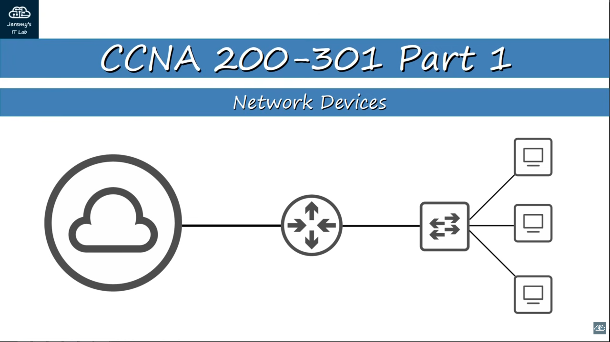

## CCNA / Cisco Certified Network Associate

### Topics
- Network Devices

### Sources
- Jeremy's IT Lab | Youtube

### Introduction
Irei documentar neste repositório todo o meu apredizado de Networking, como se fosse um guia do meu aprendizado. Vou documentar para provar o meu conhecimento e prática sobre o assunto, pois de nada adianta seguir um roadmap e não possuir conhecimento nem prática sobre o assunto. Esse repositório será um ótimo guia para você, se quiser aprender networking, é claro. 
Aqui mostrarei além do meu conhecimento e aplicações práticas, as minhas dores e erros. 

-----

### Network Devices
This knowledge will be the foundation which we will build upon, during the rest of this course.
We will cover all these network symbols, functions and how they work together to make network:

A computer network is a system made up of two or more interconnected devices that share data or resources between them. These networks can be connected via physical means (copper wire, fiber optic cable) or via wireless technology (radio or Wi-Fi) using standard rules called communication protocols (TCP/IP).

- Endpoint / End hosts is a devices can be a client or a server.
- A client is a device that accesses a service made available by a server.
- Server is a device that provides functions or services for clients.
- Imagine a situation where a company has two computers at São Paulo and two servers at Tokyo. Typically, you don't connect endpoints/end hosts (they are the same) directly to each other, you aggregate the connections to a device called switch. A switch forward traffic within a LAN. A switch don't connect two LAN (local area network) inside the internet.
  Switch provides connectivity to hosts within the same LAN. It do not provide connectivity to lan to lan, and do not provide connectivity to the internet, to do so, we need another kind of device, a router.
- We connect switches to a router to establish a connection to the internet. For example, if a computer in São Paulo requests a file from a server in Tokyo, the computer sends the request through the switch to its local router. The router forwards the packet across the internet to the Tokyo router, which delivers it through the local switch to the destination server. The reply then follows the reverse path.
