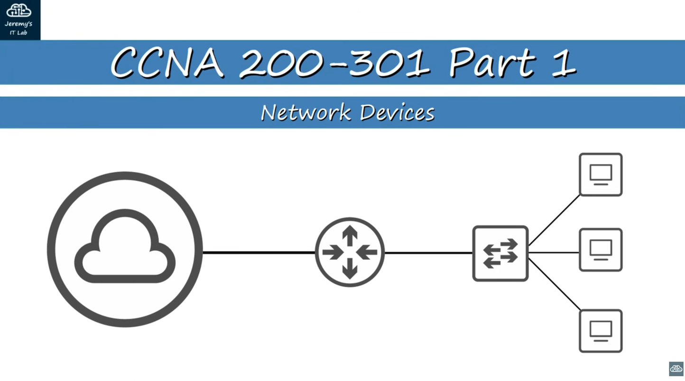
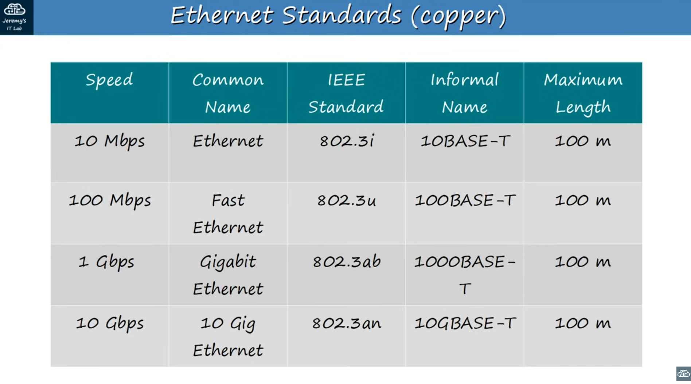
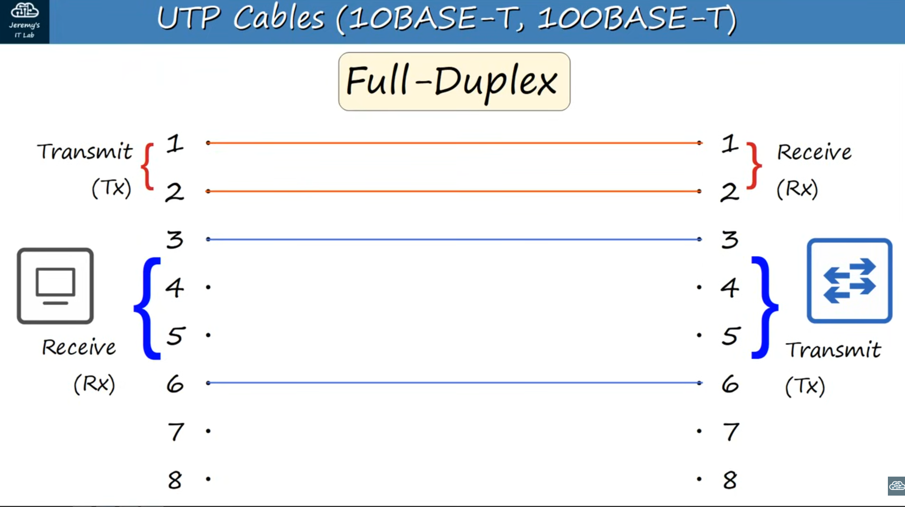
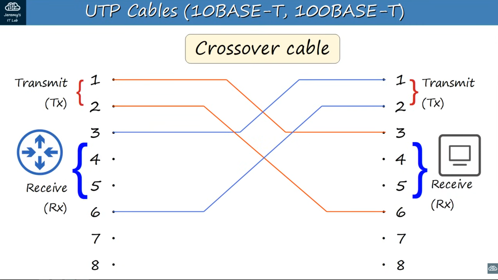
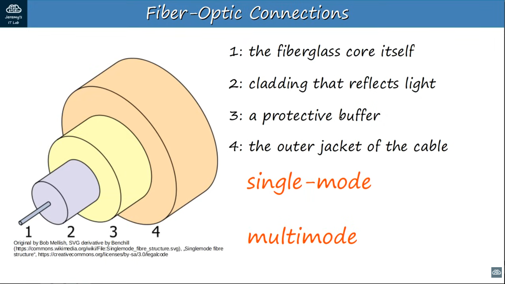
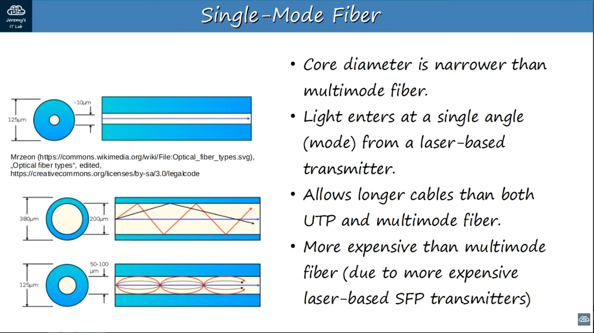
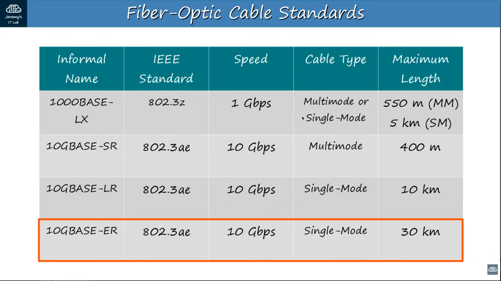

## CCNA / Cisco Certified Network Associate

### Topics
- Day One | Network Devices
- Day One | Packet Tracer Introduction
### Sources
- Jeremy's IT Lab | Youtube

### Introduction
Irei documentar neste repositório todo o meu apredizado de Networking, como se fosse um guia do meu aprendizado. Vou documentar para provar o meu conhecimento e prática sobre o assunto, pois de nada adianta seguir um roadmap e não possuir conhecimento nem prática sobre o assunto. Esse repositório será um ótimo guia para você, se quiser aprender networking, é claro. 
Aqui mostrarei além do meu conhecimento e aplicações práticas, as minhas dores e erros. 

## Day One | Jeremy's IT lab | CCNA 200-301 

### Network Devices
This knowledge will be the foundation which we will build upon, during the rest of this course.
We will cover all these network symbols, functions and how they work together to make network:

A computer network is a system made up of two or more interconnected devices that share data or resources between them. These networks can be connected via physical means (copper wire, fiber optic cable) or via wireless technology (radio or Wi-Fi) using standard rules called communication protocols (TCP/IP).

- Endpoint / End hosts is a devices can be a client or a server.
- A client is a device that accesses a service made available by a server.
- Server is a device that provides functions or services for clients.
- Imagine a situation where a company has two computers at São Paulo and two servers at Tokyo. Typically, you don't connect endpoints/end hosts (they are the same) directly to each other, you aggregate the connections to a device called switch. A switch forward traffic within a LAN. A switch don't connect two LAN (local area network) inside the internet. Switch provides connectivity to hosts within the same LAN. It do not provide connectivity to lan to lan, and do not provide connectivity to the internet, to do so, we need another kind of device, a router.
- We connect switches to a router to establish a connection to the internet. For example, if a computer in São Paulo requests a file from a server in Tokyo, the computer sends the request through the switch to its local router. The router forwards the packet across the internet to the Tokyo router, which delivers it through the local switch to the destination server. The reply then follows the reverse path.
- Imagine someone is trying to steal or harm a company, what will protect them? A firewall. A Firewall are specialty security network devices that control network traffic entering and exiting a network. Firewalls can be placed outside of your router or inside a network. What is important is they protect the endpoints inside the network, like PCs and servers. They must be configured with security rules to determine which network traffic should be allowed and which should be denied. There are host-based firewall also, which are software that protect only the host-machine. Another important concept is a next-generation firewall, which combines traditional firewall features with more advanced filtering functionalities.

## Day One | Packet Tracer Introduction
Cisco Packet Tracer are a network simulation tool, this virtual environment lab allows you to practice networking, IoT and cybersecurity.

There are four type of files in packet tracer:

.pkt	This file is created when a simulated network is built and saved. It does not include an instructions window or activity scoring.
.pkz	This is a deprecated file type that was used to embed images and other files within a Packet Tracer file.
.pka	This file type contains a Packet Tracer activity along with an instruction window, which guides users through the necessary processes to complete the activity.
.pksz	This file type bundles an initial network, an answer network, media assets, and a scripting file for hints.

## Day two | Jeremy's IT lab | CCNA 200-301

#### Interfaces and Cables

One characteristics about a switch is that they have a lot of interfaces, or ports.
A switch have RJ-45 (Registered Jack) interfaces that receive RJ-45 copper cables, the RJ-45 connector is used on the end of a copper Ethernet cable. 

But... What is Ethernet?

Ethernet is a collection of network protocols and standards, rather than just a single protocol.

But... What are network protocols, Erick?

Imagine there is one person who speaks English and another who speaks Japanese. They can't communicate with each other. They need a standard way to communicate between them, and network protocols work the same way. Imagine different devices with ports that can't connect to a switch. That is why the industry has standards.

#### Bits and bytes
Connections between devices in a network operate at a set speed. **This** speed is measured in bits per second. A bit is represented by **0 or 1**. **Bytes are** represented by eight zeros or ones. Now imagine **an internet connection over copper wires**, where your PC is connected to the router. Internet speed is measured **in bits, not bytes** such as **1 megabit or 2 gigabits**. One **bit** is interpreted **at a time**

#### Ethernet Standards
These were defined by IEEE (Institute of Electrical and Electronics Engineers) 802.3 standard in 1983 

### UTP Cables
The ethernet copper cables used in ethernet cables is UTP cables. UTP mean unshielded Twisted pair. Unshielded mean that the wires don't have metallic shield, which can make them vulnerable to electric interference. They are twisted because it protects against EMI (Electromagnetic Interference).
They can be twisted with two pairs and four pairs (Each pair have two cables) to plug into  .
So...
10 BASE-T 
            = 2 pairs (4 wires)
100 BASE-T 

1000 BASE-T
           = 4 pairs (8 wires)
10G BASE-T

How the pin works?
Each RJ-45 have 8 pin, these pins have different purposes.

In a 10/100 Mbps connection between a PC (or Router) and a Switch, pins 1 and 2 on the PC/Router side transmit data (Tx), while pins 1 and 2 on the Switch side receive it (Rx). On the second pair, pins 3 and 6 on the Switch side transmit data (Tx), and pins 3 and 6 on the PC/Router side receive it (Rx). Because transmission and reception happen on separate wire pairs, this operates in Full-Duplex mode, avoiding data collisions.
This is called straight-Trough cable.

If we want to connect a switch to a switch, or a router to another router, or two PCs, we need to use a Crossover cable. 

In a crossover cable, the data in transmitted in the pin one and two and is received in the pin tree and six. Then at the other side is reversed, the data is transmitted (tx) in the pin one and two and is received (rx) in the pin tree and six.

But in the modern days, companies prefer Auto MDI-X.

#### Auto MDI-X
With Auto MDI-X you do not need to worry with the pins because they auto regulate which pin it will use. So if there are two switches, the pin one and two can transmit data and pin one and two can receive the data. Tree and six can transmit the data and tree and six can receive the data also.

#### 1000 BASE-T and 10G BASE-T
These type of ethernet is bidirectional, which mean pin one can send data and at the other side, pin one can also receive the data. And the eight wires is used.

#### Fiber-Optic Connections
Fiber-Optic is superior in many ways and be used for large connections. If you remember, copper UTP wire connections are used in 100 meters only, good for LAN connections.

As you remember, in a Cisco Switch there are twenty four ports for RJ-45 connectors, but there are also four interfaces for SFP (Small Form-Factor Pluggable) transceiver. These SFP transceivers accept fiber-optic cable. They send data not through electrical signals, but through light over glass fibers, yes,**light**. It looks like magic, isn't?
At the cable end, there is two connectors. That is because one connector transmit data and the another receive. It is pretty simple.

Let's take a look at the fiber-optic structure:

Single-mode and multi-mode are two type of fiber-optic cables.

The multi-mode cable, have wider core diameter than single-mode fiver, allowing the light to reflect in different angles (modes) inside the fiberglass core. The cables are longer than the UTP, but they still lose to single-mode fiber. It is cheaper than single mode, due to the LED-based SFP transmitters.

The single-mode core fiber glass is narrower than the multi-mode and the light enters at a single angle (mode) from a laser-based transmitter. Single mode fiber cables are longer than the multi-mode ones and more expensive also.

Check the fiber-optic IEE Standards:

## Day Three | Jeremy's IT Lab | CCNA 200 - 301

Now it will be presented Internet Protocol Suite. These protocols is a set of rules defining how data should be communicated between devices over a network. Protocols are  the languages that computers use to communicate.
In the early days of networking, protocols were typically proprietary and developed by individual vendors (such as IBM) to work exclusively with their own hardware. To allow devices from different vendors to communicate, modern protocol standards were established through government research initiatives, key internet pioneers, and independent standards organizations.

#### Who defines the standards?

Most network standards are developed by independent standards organizations, not by a single vendor, with participation from engineers at many companies.
The main ones is IEEE (Institute of Electrical and Electronics Engineers) and IETF (Internet Engineering Task Force), an open community that defines protocols used on the internet (TCP, IP, UDP, HTTP, DNS, etc.)

### Layered 
 

 

